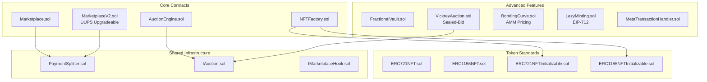

# 🎨 NFT Marketplace

> NFT marketplace with UUPS upgradeability, role-based access control, and advanced auction mechanisms.

[](https://soliditylang.org/)
[](https://opensource.org/licenses/MIT)
[](./test)

---

## 🏗️ Architecture



---

## ✅ Features

### Core
| Feature | Contract | Status |
|---------|----------|--------|
| ERC-721 & ERC-1155 support | `Marketplace.sol` | ✅ |
| Buy/Sell/List NFTs | `Marketplace.sol` | ✅ |
| Offer system | `Marketplace.sol` | ✅ |
| English auctions | `AuctionEngine.sol` | ✅ |
| Dutch auctions | `AuctionEngine.sol` | ✅ |
| Anti-sniping | `AuctionEngine.sol` | ✅ |
| EIP-2981 royalties | All token contracts | ✅ |

### Advanced
| Feature | Contract | Status |
|---------|----------|--------|
| UUPS Upgradeability | `MarketplaceV2.sol` | ✅ |
| Role-based access | `MarketplaceV2.sol` | ✅ |
| ERC20 payments | `MarketplaceV2.sol` | ✅ |
| Lazy minting (EIP-712) | `LazyMinting.sol` | ✅ |
| Meta-transactions | `MetaTransactionHandler.sol` | ✅ |
| Fractional ownership | `FractionalVault.sol` | ✅ |
| Sealed-bid auctions | `VickreyAuction.sol` | ✅ |
| Bonding curves | `BondingCurve.sol` | ✅ |
| Hook system | `IMarketplaceHook.sol` | ✅ |
| Flash loan resistance | Core contracts | ✅ |

---

## 🔐 Security

| Pattern | Implementation |
|---------|----------------|
| Reentrancy protection | OpenZeppelin `ReentrancyGuard` |
| Access control | `AccessControl` with roles |
| Flash loan resistance | Same-block interaction prevention |
| Pausable | Emergency stop functionality |
| CEI pattern | All state changes before transfers |
| Locked pragma | `0.8.20` / `0.8.22` |

---

## 📁 Project Structure

```
contracts/
├── core/
│   ├── Marketplace.sol         # Basic marketplace
│   ├── MarketplaceV2.sol       # Upgradeable + ERC20 + roles
│   ├── AuctionEngine.sol       # English & Dutch auctions
│   └── NFTFactory.sol          # Clone-based deployment
├── advanced/
│   ├── FractionalVault.sol     # NFT fractionalization
│   ├── VickreyAuction.sol      # Sealed-bid commit-reveal
│   ├── BondingCurve.sol        # AMM for NFT collections
│   ├── LazyMinting.sol         # Gas-free minting
│   └── MetaTransactionHandler.sol
├── tokens/
│   ├── erc721/                 # ERC-721 implementations
│   └── erc1155/                # ERC-1155 implementations
├── libraries/
│   └── PaymentSplitter.sol     # Shared fee distribution
└── interfaces/
    ├── IAuction.sol            # Auction interface hierarchy
    └── IMarketplaceHook.sol    # Extensibility hooks
```

---

## 🚀 Quick Start

```bash
# Install
npm install

# Compile
npm run compile

# Test
npm run test

# Coverage
npm run coverage

# Deploy
npm run deploy:sepolia
```

---

## 🧪 Testing

```
152 tests passing

- AuctionEngine: 30 tests
- Marketplace: 25 tests
- NFTFactory: 17 tests
- FractionalVault: 15 tests
- LazyMinting: 9 tests
- MetaTransactionHandler: 9 tests
- Token contracts: 47 tests
```

---

## 🛠️ Technology

| Layer | Technology |
|-------|------------|
| Smart Contracts | Solidity 0.8.20, 0.8.22 |
| Framework | Hardhat |
| Testing | Chai, Mocha |
| Security | OpenZeppelin Contracts v5 |
| Standards | ERC-721, ERC-1155, EIP-712, EIP-2981 |

---

## 📜 License

MIT
